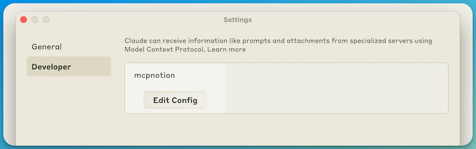
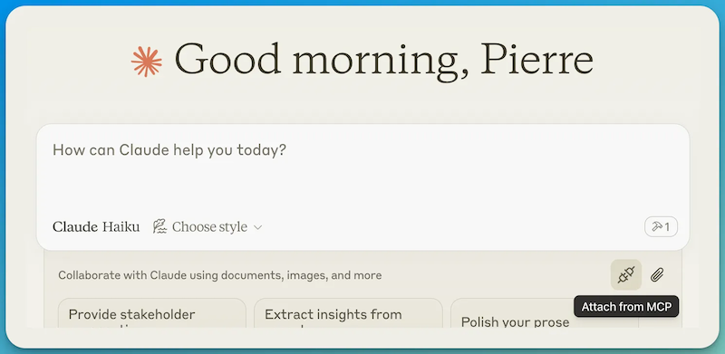
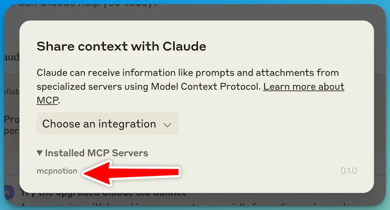
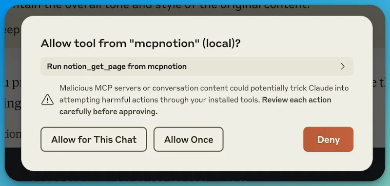
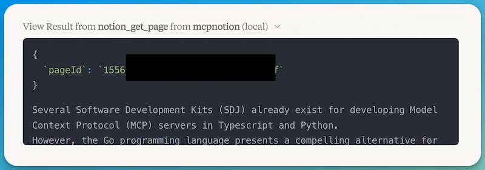

# gomcp-tool-notion

Notion tool for the Model Context Protocol

This is a sample MCP server that uses the Notion API to retrieve the content of a Notion page.

The Model Context Protocol SDK being used is the [MCP Go SDK](https://github.com/llmcontext/gomcp).

A description of the go MCP SDK can be found [here](https://pcarion.com/blog/go_model_context_protocol/).

## Instructions

### configuration file

The configuration file is a JSON file that defines the server information, logging, prompts, and tools.

copy the `mcpnotion.json.sample` file to `mcpnotion.json` and edit the values:
* set `logging.file` to the path where you want to store the log file
* set `prompts.file` to the path to the `prompts.yaml` file
* set `tools.configuration.notionToken` to your Notion token

### build the server

Get all the dependencies:
```
go mod tidy
```

Build the server:
```
make
```

This will create the `mcpnotion` binary in the `bin` directory.

### integrate with Claude

You need to add your server to the Claude configuration file.

You can easily access this file from the Settings menu in Claude:



Add tour server in the `mcpServers` section (replace `<absolute path>` with the actual path to your files):

```json
{
  "mcpServers": {
    "mcpnotion": {
      "command": "<absolute path>/mcpnotion",
      "args": ["--configFile", "<absolute path>/mcpnotion.json"]
    }
  }
}
```

You MUST restart Claude after adding the server.

Once Claude has restarted, you can check that the server is running by checking the log file you specified in the configuration file.

You can also check in the Claude UI that the server is running by clicking on the icon there:



Your server should appear in the list of Installed MCP Servers:



You can prompt Claude to use your server by mentioning it in your prompt.

For example, you can ask:

```
Can you summarise the content of the Notion page with the pageId xxxxxxxx?
```

When Claude is abut to call your function, it will ask you for authorization:



After you grant authorization, Claude will show the parameters of the call and the response from your server in the chat.




## Note

If you also work on the MCP Go SDK itself, you can add this line to the `go.mod` file to use your local version of the SDK:

```
replace github.com/llmcontext/gomcp v0.2.0 => ../gomcp
```
